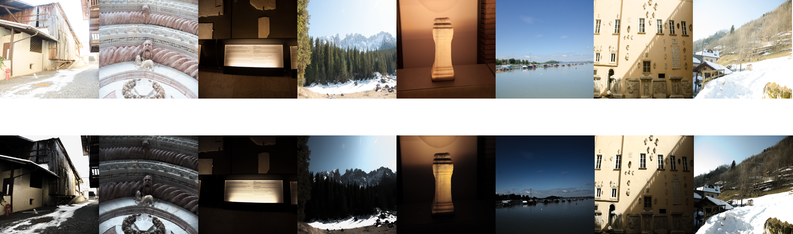
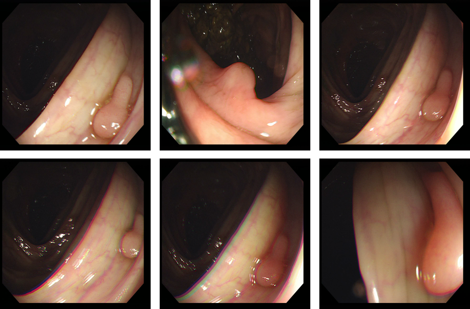
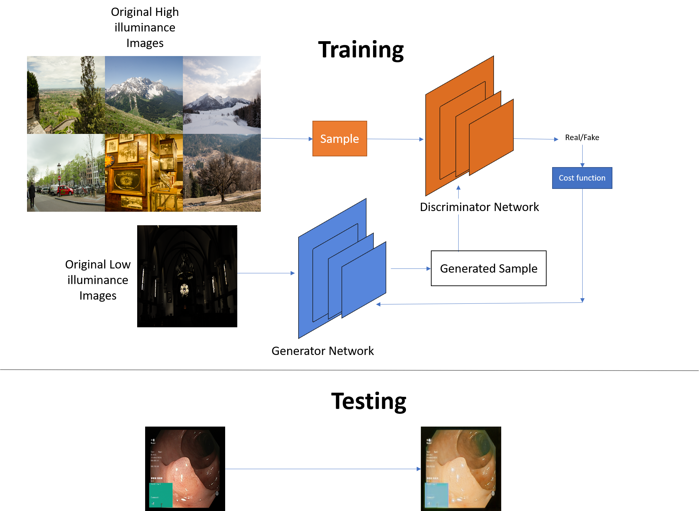

***Enhancing Low-Light Endoscopy Images with Generative Adversarial Networks: A Step Forward in Diagnostic Precision***

1.  **Raise Dataset**

Natural normal light images with their corresponding low light images from RAISE dataset [1]. <https://qualinet.github.io/databases/image/raise___a_raw_images_dataset_for_digital_image_forensics/>

2.  **CVC COlonDB**

Low light endoscopy images taken from CVC-colonDB [2]

<http://vi.cvc.uab.es/colon-qa/cvccolondb/>

3.  **Proposed Methods**

The flowchart of Generative Adversarial Network for generation of high illuminance endoscopy images. Training is done by using RAISE dataset [1] and used trained model for endoscopy image enhancement.

4.  **Visual Comparative Results**

1st row: Polyp segmentation Kvasir dataset [3] original images, 2nd row: DONG [4] , 3rd row: LIME [5], 4th: row MF [6], 5th row: MSR [7], 6th row: NPE [8], 7th row: SRIE [9], and 8th row: synthesized images generated by the proposed method.

5.  **Quantitative Results**

Comparison of the mean, standard deviation, COV and NIQE averge values for 1000 images of Polyp segmentation Kvasir dataset.

| **Method**      | **Mean (µ)** | **Std Dev (σ)** | **COV (σ/µ)** | **NIQE (Images)** |
|-----------------|--------------|-----------------|---------------|-------------------|
| Original image  | 81.3         | 71.81           | 0.89          | 23.54 / 976       |
| DONG [4]        | 105.94       | 76.61           | 0.72          | 24.84 / 979       |
| LIME [5]        | 118.68       | 85.07           | 0.72          | 28.49 / 923       |
| MF [6]          | 92.39        | 72.24           | 0.78          | 24.15 / 972       |
| MSR [7]         | 167.58       | 71.22           | 0.42          | 27.35 / 870       |
| NPE [8]         | 95.34        | 71.01           | 0.76          | 28.27 / 921       |
| SRIE [9]        | 100.44       | 74.66           | 0.74          | 26.33 / 933       |
| Proposed Method | 116.45       | 79.93           | 0.69          | 27.00 / 923       |

6. **Refrences**

[1] D.-T. Dang-Nguyen, C. Pasquini, V. Conotter, and G. Boato, “Raise: A raw images dataset for digital image forensics,” in *Proceedings of the 6th ACM multimedia systems conference*, 2015, pp. 219–224.

[2] J. Bernal, “Towards Automatic Polyp Detection with a Polyp Appearance Model,” 2013.

[3] K. Pogorelov *et al.*, “Kvasir: A multi-class image dataset for computer aided gastrointestinal disease detection,” in *Proceedings of the 8th ACM on Multimedia Systems Conference*, 2017, pp. 164–169.

[4] X. Dong *et al.*, “Fast efficient algorithm for enhancement of low lighting video,” in *2011 IEEE International Conference on Multimedia and Expo*, 2011, pp. 1–6.

[5] X. Guo, Y. Li, and H. Ling, “LIME: Low-light image enhancement via illumination map estimation,” *IEEE Transactions on image processing*, vol. 26, no. 2, pp. 982–993, 2016.

[6] X. Fu, D. Zeng, Y. Huang, Y. Liao, X. Ding, and J. Paisley, “A fusion-based enhancing method for weakly illuminated images,” *Signal Processing*, vol. 129, pp. 82–96, 2016.

[7] D. J. Jobson, Z. Rahman, and G. A. Woodell, “A multiscale retinex for bridging the gap between color images and the human observation of scenes,” *IEEE Transactions on Image processing*, vol. 6, no. 7, pp. 965–976, 1997.

[8] S. Wang, J. Zheng, H.-M. Hu, and B. Li, “Naturalness preserved enhancement algorithm for non-uniform illumination images,” *IEEE Transactions on Image Processing*, vol. 22, no. 9, pp. 3538–3548, 2013.

[9] X. Fu, D. Zeng, Y. Huang, X.-P. Zhang, and X. Ding, “A weighted variational model for simultaneous reflectance and illumination estimation,” in *Proceedings of the IEEE Conference on Computer Vision and Pattern Recognition*, 2016, pp. 2782–2790.
